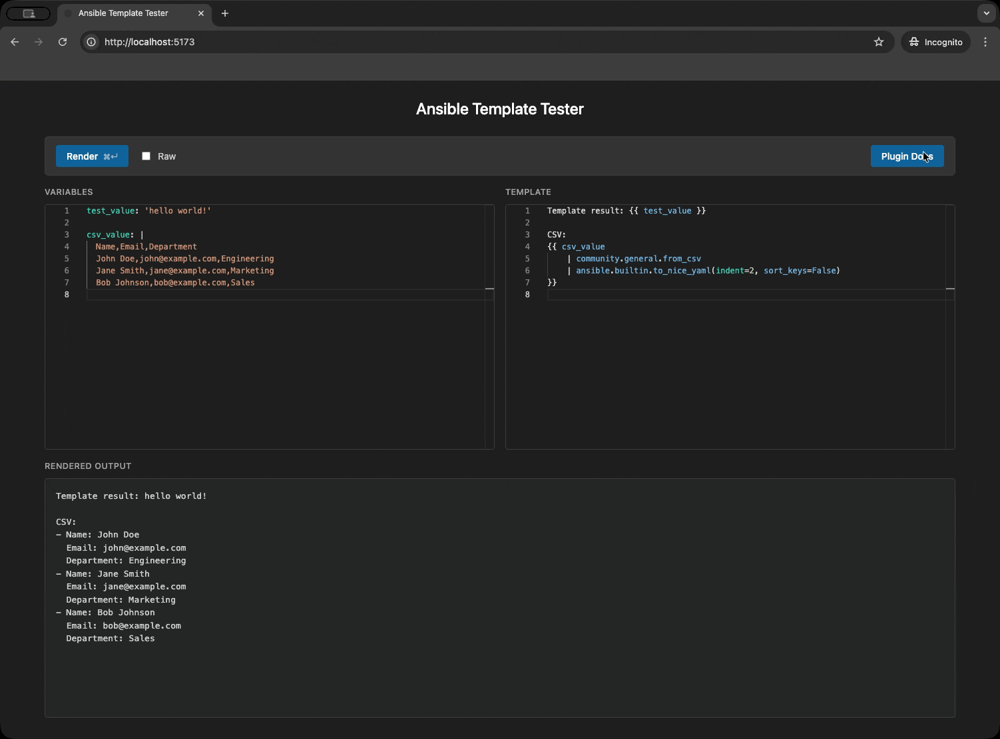
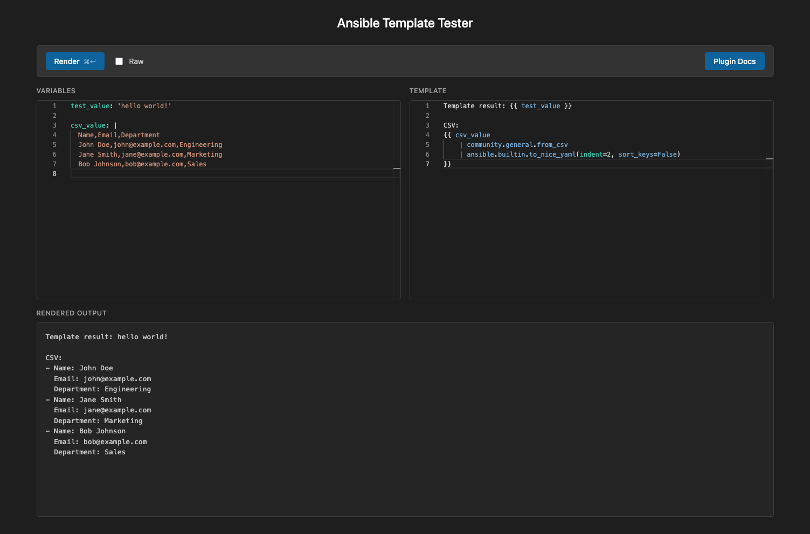

# ansible-template-ui

Web UI for testing Ansible/Jinja2 templates. Paste a template and variables, get the rendered output.

**Features:**

- Monaco editor panes with syntax highlighting and completion for plugin names and arguments
- Built-in documentation for all Ansible and Jinja2 plugins
- Use your own custom Ansible plugins (filter, lookup, test)
- Install Ansible plugins from collections on Ansible Galaxy

<details>
  <summary>Click for plugin list & documentation demo</summary>
  
</details>



> [!WARNING]
> 🤖 **Vibe coded.**
> 
> The changes to this fork of [sivel/ansible-template-ui](https://github.com/sivel/ansible-template-ui) were almost exclusively carried out by a LLM.
> 
> I wanted a thing, I didn't want to write the thing, so the clanker did it. Make of that what you will.

## Quick Start

### Docker Compose (recommended)

```bash
docker compose up -d
```

The UI is available at `http://localhost:8080`.

### Docker

```bash
docker run -d \
  -p 8080:8080 \
  -v /var/run/docker.sock:/var/run/docker.sock \
  ghcr.io/tigattack/ansible-template-ui:latest
```

> [!IMPORTANT]
> The container needs access to the Docker socket because each render request spins up a temporary container with Ansible installed to evaluate the template.

## Configuration

All configuration is via environment variables.

| Variable                     | Default                                        | Description                                                                   |
| ---------------------------- | ---------------------------------------------- | ----------------------------------------------------------------------------- |
| `DOCKER_IMAGE`               | `ghcr.io/tigattack/ansible-template-renderer` | Docker image used for the render container                                    |
| `HOST`                       | `127.0.0.1`                                    | Bind address (dev server only)                                                |
| `PORT`                       | `8080`                                         | Listen port (dev server only)                                                 |
| `DEBUG`                      | `false`                                        | Enable hot reload (dev server only)                                          |
| `LOG_FORMAT`                 | _(auto)_                                       | Log output format: `pretty`, `json`, or auto-detect by TTY                    |
| `CONTAINER_TIMEOUT`          | `180`                                          | Max seconds to wait for a render container before timing out                  |
| `IMAGE_CACHE_TTL`            | `300`                                          | Seconds between re-pulling the render image. Set to `0` to pull every request |
| `CONTAINER_MEM_LIMIT`        | `96m`                                          | Max memory for render container                                               |
| `FILTER_PLUGIN_PATH`         | `/plugins/filter`                              | Container path to custom Jinja2 filter plugins (see [Custom Plugins](#custom-plugins)) |
| `LOOKUP_PLUGIN_PATH`         | `/plugins/lookup`                              | Container path to custom lookup plugins (see [Custom Plugins](#custom-plugins))    |
| `TEST_PLUGIN_PATH`           | `/plugins/test`                                | Container path to custom Jinja2 test plugins (see [Custom Plugins](#custom-plugins)) |
| `ANSIBLE_GALAXY_COLLECTIONS` | _(empty)_                                      | Space-separated Galaxy collections (cached in Docker volume)                  |

## Custom Plugins

Two mechanisms are supported for extending Ansible with custom plugins at render time.

### Bind-Mount Plugin Directories

Bind-mount your plugin directories into `/plugins/<type>` (where `<type>` is `filter`, `lookup`, or `test`).

If you need to mount plugins at a non-default path, set `FILTER_PLUGIN_PATH`, `LOOKUP_PLUGIN_PATH`, or `TEST_PLUGIN_PATH` to the container path where your plugins are mounted.

Bind filter plugins from host to default path:

```bash
docker run -d \
  -p 8080:8080 \
  -v /var/run/docker.sock:/var/run/docker.sock \
  -v /my/filter_plugins:/plugins/filter:ro \
  ghcr.io/tigattack/ansible-template-ui:latest
```

Bind filter plugins from host to custom path:

```bash
docker run -d \
  -p 8080:8080 \
  -v /var/run/docker.sock:/var/run/docker.sock \
  -v /my/filter_plugins:/my_filter_plugins:ro \
  -e FILTER_PLUGIN_PATH=/my_filter_plugins \
  ghcr.io/tigattack/ansible-template-ui:latest
```

### Galaxy Collections

Set `ANSIBLE_GALAXY_COLLECTIONS` to a space-separated list of collection names.

Collections are installed once at app startup into a persistent Docker volume, keyed by a hash of the collection list. Subsequent starts with the same collection list skip installation. Changing the collection list and restarting triggers a fresh install. During startup warmup, render requests will return a friendly "warming up" message until collections are ready.

```bash
docker run -d \
  -p 8080:8080 \
  -v /var/run/docker.sock:/var/run/docker.sock \
  -e ANSIBLE_GALAXY_COLLECTIONS="community.general community.crypto" \
  ghcr.io/tigattack/ansible-template-ui:latest
```

## Docker Compose

There are two compose files:

- `compose.yml` — production (pulls pre-built images from GHCR)
- `compose.dev.yml` — development (builds images locally, bind-mounts source, enables hot reload)

**Production:**

```bash
docker compose up -d
```

**Development:**

```bash
docker compose -f compose.dev.yml up -d --build
```

This builds the renderer image locally, starts the backend (`web-dev`) and frontend Vite dev server (`frontend-dev`). The frontend is available at `http://localhost:5173` and proxies `/render` to the backend at `http://localhost:8080`.

## Development

### Prerequisites

- [uv](https://docs.astral.sh/uv/)
- [Bun](https://bun.sh)
- Docker
- Python 3.14+

### Setup

```bash
uv sync                   # install Python dependencies (including lefthook)
uv run lefthook install   # register git hooks
```

### Backend

```bash
uv sync
uv run python -m ansible_template_ui   # uvicorn dev server on :8080
```

### Frontend

```bash
cd frontend
bun install
bun run dev    # Vite dev server on :5173 with proxy to the backend at :8080
```

Run both simultaneously for local development. The Vite dev server proxies `/render` to the backend.

### Building the Frontend

```bash
cd frontend
bun run build   # Outputs to ansible_template_ui/client/
```

The built assets are served by FastAPI directly in production.

### Running Tests

```bash
uv run pytest tests/ -v
```

### Building Docker Images

The web app image (`docker/web/Dockerfile`):

```bash
docker build -f docker/web/Dockerfile --target prod -t ghcr.io/tigattack/ansible-template-ui .
```

The render container image (`docker/renderer/Dockerfile`) — this is the image that Ansible runs inside:

```bash
docker build -t ghcr.io/tigattack/ansible-template-renderer docker/renderer/
```
